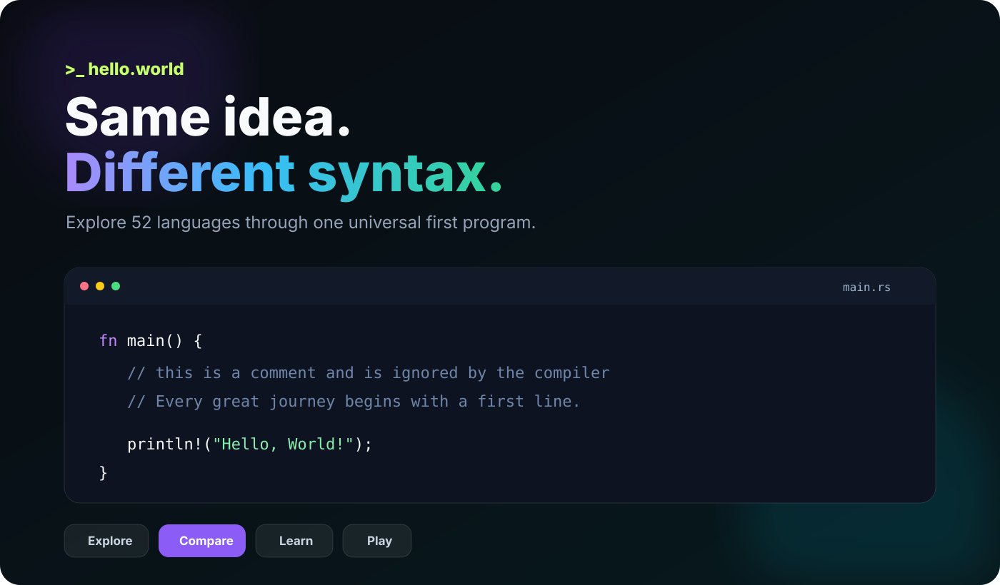
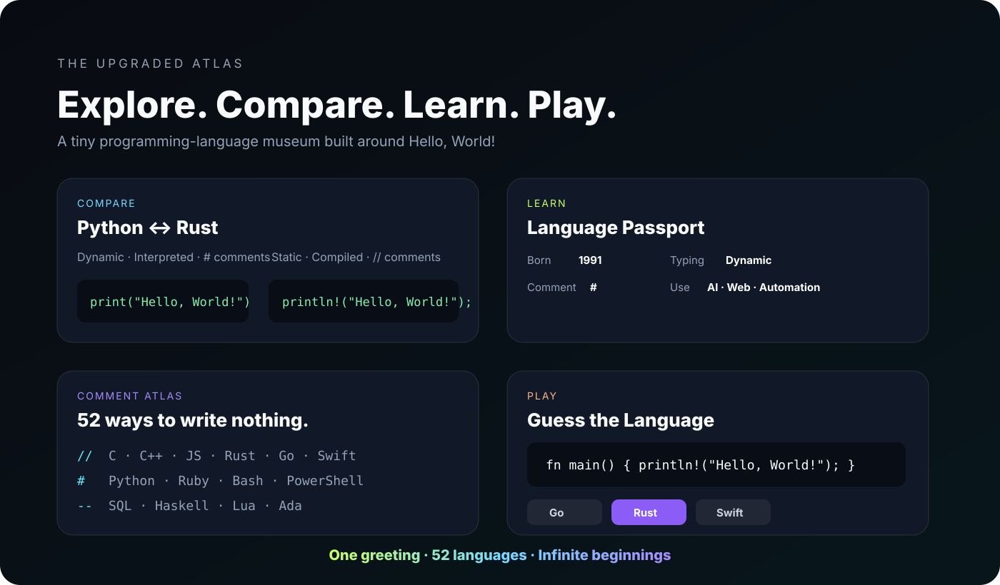

<div align="center">
  

# Hello World Atlas

### One greeting. **52 languages & formats.** Infinite beginnings.

A playful, interactive programming-language museum built around the most iconic first program in computing — **`Hello, World!`**

[](https://hello-world-atlas-rishi.vercel.app)
[](./LANGUAGES.md)
[](https://github.com/Rishikeshsanin/hello-world/actions)
[](./LICENSE)

**[✦ Open the live atlas](https://hello-world-atlas-rishi.vercel.app)** · **[Browse all languages](./LANGUAGES.md)** · **[Contribute](./CONTRIBUTING.md)**

</div>

---

## ✨ What is this?

Every programmer starts somewhere. For many of us, that somewhere is a tiny program that makes a computer answer back:

```text
Hello, World!
```

**Hello World Atlas** collects that same greeting across modern languages, classic languages, shells, markup, scientific ecosystems, functional languages, and more — then turns the collection into an interactive experience where you can **explore, compare, learn, and play**.

> Different syntax. Different eras. Same little spark.

---

## 🖥️ Upgraded Version

<div align="center">
  <a href="https://hello-world-atlas-rishi.vercel.app">
    
  </a>
</div>

The live site is intentionally lightweight and framework-free, but it is more than a static code gallery:

| Mode | What it does |
|---|---|
| **Explore** | Search and filter all 52 entries, open the real source, copy code, or pick a random hello. |
| **Compare** | Put two languages side by side and compare syntax, category, files, and comment style. |
| **Learn** | Open compact language passports and explore the **Comment Atlas**. |
| **Play** | Guess a language from its Hello World syntax and build a score + streak. |

<div align="center">
  
</div>

### Also built in

- 🌗 dark + light themes
- 🔎 instant search and ecosystem filters
- ✦ random language discovery
- 📋 copy-to-clipboard
- ↗ direct GitHub source links
- ⌨️ keyboard shortcuts
- 📱 responsive mobile layout
- 🧭 rotating real-source hero preview
- ✅ automated catalog integrity checks
- 🚫 no database or account required

---

## 💬 The two-comment idea

Every source file keeps the classic greeting **and** carries two tiny comments:

1. an educational comment showing what a comment is,
2. a small positive line that gives the project its personality.

For example, in C:

```c
#include <stdio.h>

int main(void) {
    // this is a comment and is ignored by the compiler
    // Every great journey begins with a first line.
    printf("Hello, World!\n");
    return 0;
}
```

Different languages use different comment syntax — `//`, `#`, `--`, `%`, `;`, `<!-- -->`, `/* */`, and more — which inspired the interactive **Comment Atlas** on the website.

---

## 🌍 52 languages & formats

| | | | |
|---|---|---|---|
| [Ada](./Ada/hello.adb) | [Assembly](./Assembly/hello.asm) | [Bash](./Bash/hello.sh) | [BASIC](./BASIC/hello.bas) |
| [C](./C/main.c) | [C++](./C%2B%2B/main.cpp) | [C#](./C-Sharp/Program.cs) | [Clojure](./Clojure/hello.clj) |
| [COBOL](./COBOL/hello.cob) | [Common Lisp](./Common-Lisp/hello.lisp) | [Crystal](./Crystal/hello.cr) | [CSS](./CSS/hello.css) |
| [D](./D/hello.d) | [Dart](./Dart/hello.dart) | [Elixir](./Elixir/hello.exs) | [Erlang](./Erlang/hello.erl) |
| [F#](./F-Sharp/hello.fsx) | [Fortran](./Fortran/hello.f90) | [Go](./Go/main.go) | [Groovy](./Groovy/hello.groovy) |
| [Haskell](./Haskell/Main.hs) | [HTML](./HTML/index.html) | [Java](./Java/Main.java) | [JavaScript](./JavaScript/hello.js) |
| [Julia](./Julia/hello.jl) | [Kotlin](./Kotlin/Main.kt) | [Lua](./Lua/hello.lua) | [MATLAB](./MATLAB/hello.m) |
| [Nim](./Nim/hello.nim) | [Objective-C](./Objective-C/main.m) | [OCaml](./OCaml/hello.ml) | [Pascal](./Pascal/hello.pas) |
| [Perl](./Perl/hello.pl) | [PHP](./PHP/index.php) | [PowerShell](./PowerShell/hello.ps1) | [Prolog](./Prolog/hello.pl) |
| [Python](./Python/hello.py) | [R](./R/hello.R) | [Racket](./Racket/hello.rkt) | [Ruby](./Ruby/hello.rb) |
| [Rust](./Rust/main.rs) | [Scala](./Scala/Main.scala) | [Scheme](./Scheme/hello.scm) | [Solidity](./Solidity/HelloWorld.sol) |
| [SQL](./SQL/hello.sql) | [Swift](./Swift/hello.swift) | [Tcl](./Tcl/hello.tcl) | [TypeScript](./TypeScript/hello.ts) |
| [VB.NET](./VB.NET/Program.vb) | [Zig](./Zig/main.zig) | [Markdown](./Markdown/hello.md) | [XML](./XML/hello.xml) |

For categories, filenames, and the full index, see **[LANGUAGES.md](./LANGUAGES.md)**.

---

## 🪄 Same greeting, different syntax

<table>
<tr>
<td width="50%">

**Python**

```python
# this is a comment and is ignored by the interpreter
# Every great journey begins with a first line.
print("Hello, World!")
```

</td>
<td width="50%">

**Rust**

```rust
fn main() {
    // this is a comment and is ignored by the compiler
    // Every great journey begins with a first line.
    println!("Hello, World!");
}
```

</td>
</tr>
<tr>
<td width="50%">

**JavaScript**

```javascript
// this is a comment and is ignored by the interpreter
// Every great journey begins with a first line.
console.log("Hello, World!");
```

</td>
<td width="50%">

**Go**

```go
package main

import "fmt"

func main() {
    // this is a comment and is ignored by the compiler
    // Every great journey begins with a first line.
    fmt.Println("Hello, World!")
}
```

</td>
</tr>
</table>

---

## 🗂️ Project structure

```text
hello-world/
├── Ada/ ... XML/                # 52 language / format examples
├── website/                     # production interactive atlas
│   ├── index.html
│   ├── styles.css
│   ├── app.js
│   ├── catalog.json
│   └── favicon.svg
├── docs/                        # original lightweight explorer
├── assets/
│   ├── hero.svg
│   └── showcase/                # README visual previews
├── scripts/
│   └── check_catalog.py         # catalog integrity validation
├── .github/workflows/
│   └── catalog-check.yml
├── CONTRIBUTING.md
├── LANGUAGES.md
└── README.md
```

---

## 🚀 Run a few locally

```bash
# Python
python Python/hello.py

# JavaScript
node JavaScript/hello.js

# Go
go run Go/main.go

# Rust
rustc Rust/main.rs -o hello && ./hello

# C
gcc C/main.c -o hello && ./hello

# C++
g++ C++/main.cpp -o hello && ./hello
```

Each ecosystem needs its normal compiler/runtime installed.

---

## 🧪 Quality checks

The catalog is machine-readable and verified automatically with GitHub Actions.

```bash
python scripts/check_catalog.py
```

The check makes sure every catalog entry exists, still contains `Hello, World!`, and follows the project's comment convention.

---

## 🤝 Contributing

Missing a language? Found a cleaner idiomatic version? Want to improve the atlas?

Read **[CONTRIBUTING.md](./CONTRIBUTING.md)** and open a pull request. The ideal contribution is intentionally small:

- use the ecosystem's conventional filename and syntax,
- keep the visible greeting as `Hello, World!`,
- keep the educational + positive comments where comments are valid,
- avoid dependencies when the standard library is enough,
- update the catalog when adding a new language.

---

## 🎯 Roadmap

- [x] 25 languages
- [x] 50+ languages & formats
- [x] searchable language explorer
- [x] real GitHub source previews
- [x] Comment Atlas
- [x] side-by-side language comparison
- [x] language passports
- [x] Guess the Language mini-game
- [x] responsive production website
- [x] automated catalog checks
- [ ] 75 curated languages
- [ ] 100 curated languages
- [ ] richer language history / influence data
- [ ] community-submitted variants

---

## 📜 License

Distributed under the **MIT License**. See [`LICENSE`](./LICENSE).

<div align="center">

---

### `Hello, World!` is small. Starting is not.

**Build something today. 🌱**

[Live Atlas](https://hello-world-atlas-rishi.vercel.app) · [Languages](./LANGUAGES.md) · [Contributing](./CONTRIBUTING.md)

</div>
