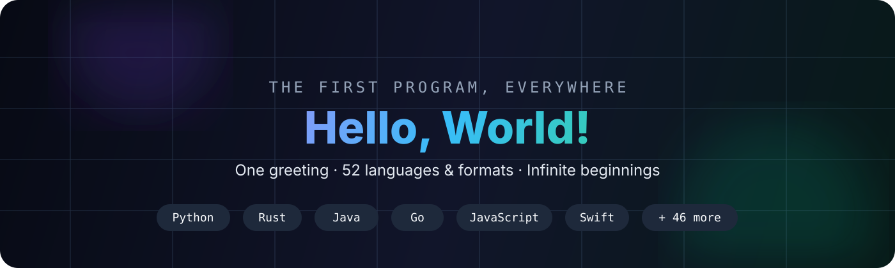

<div align="center">
  

# Hello World Atlas

**One greeting. 50+ languages. Infinite beginnings.**

A polished, growing collection of the most iconic first program in computing — `Hello, World!` — written across popular programming languages, classic languages, shells, markup, and modern ecosystems.


### [✦ Explore the live website](https://hello-world-atlas-rishi.vercel.app)

</div>

---

## 🌍 The idea

Every programmer remembers a first program. Different syntax, different tools, different eras — but the same tiny moment of making a machine say something back.

This repository turns that moment into an **atlas of programming languages**.

> **Every great build starts with one small line. Keep building.**

## ✨ What makes this different

- **52 languages & formats** in one clean, browsable collection.
- Every example is intentionally tiny and keeps the focus on the language itself.
- A positive comment is tucked into each source file without changing the classic output.
- A polished, responsive **live website** lives in [`website/`](./website/) and is deployed on Vercel.
- Search, category filters, random discovery, live source previews, copy-to-clipboard, keyboard shortcuts, and dark/light themes.
- A machine-readable catalog powers the showcase and repository checks.
- GitHub Actions verifies that every catalog entry exists and still contains `Hello, World!`.
- Contribution rules make it easy to grow toward 75, 100, and beyond.

## 🧭 Explore the atlas

| | | | |
|---|---|---|---|
| [Ada](./Ada/hello.adb) | [Assembly](./Assembly/hello.asm) | [Bash](./Bash/hello.sh) | [BASIC](./BASIC/hello.bas) |
| [C](./C/main.c) | [C++](./C%2B%2B/main.cpp) | [C#](./C-Sharp/Program.cs) | [Clojure](./Clojure/hello.clj) |
| [COBOL](./COBOL/hello.cob) | [Common Lisp](./Common-Lisp/hello.lisp) | [Crystal](./Crystal/hello.cr) | [CSS](./CSS/hello.css) |
| [D](./D/hello.d) | [Dart](./Dart/hello.dart) | [Elixir](./Elixir/hello.exs) | [Erlang](./Erlang/hello.erl) |
| [F#](./F-Sharp/hello.fsx) | [Fortran](./Fortran/hello.f90) | [Go](./Go/main.go) | [Groovy](./Groovy/hello.groovy) |
| [Haskell](./Haskell/Main.hs) | [HTML](./HTML/index.html) | [Java](./Java/Main.java) | [JavaScript](./JavaScript/hello.js) |
| [Julia](./Julia/hello.jl) | [Kotlin](./Kotlin/Main.kt) | [Lua](./Lua/hello.lua) | [MATLAB](./MATLAB/hello.m) |
| [Nim](./Nim/hello.nim) | [Objective-C](./Objective-C/main.m) | [OCaml](./OCaml/hello.ml) | [Pascal](./Pascal/hello.pas) |
| [Perl](./Perl/hello.pl) | [PHP](./PHP/index.php) | [PowerShell](./PowerShell/hello.ps1) | [Prolog](./Prolog/hello.pl) |
| [Python](./Python/hello.py) | [R](./R/hello.R) | [Racket](./Racket/hello.rkt) | [Ruby](./Ruby/hello.rb) |
| [Rust](./Rust/main.rs) | [Scala](./Scala/Main.scala) | [Scheme](./Scheme/hello.scm) | [Solidity](./Solidity/HelloWorld.sol) |
| [SQL](./SQL/hello.sql) | [Swift](./Swift/hello.swift) | [Tcl](./Tcl/hello.tcl) | [TypeScript](./TypeScript/hello.ts) |
| [VB.NET](./VB.NET/Program.vb) | [Zig](./Zig/main.zig) | [Markdown](./Markdown/hello.md) | [XML](./XML/hello.xml) |

See the full catalog in **[LANGUAGES.md](./LANGUAGES.md)**.

## 🪄 A few ways to say the same thing

```python
print("Hello, World!")
```

```rust
fn main() {
    println!("Hello, World!");
}
```

```go
package main

import "fmt"

func main() {
    fmt.Println("Hello, World!")
}
```

```haskell
main :: IO ()
main = putStrLn "Hello, World!"
```

Same message. Four very different ways of thinking.

## 🗂️ Repository map

```text
hello-world/
├── Ada/
├── C/
├── C++/
├── Java/
├── Python/
├── Rust/
├── ... 47 more language folders
├── assets/
│   └── hero.svg
├── website/
│   ├── index.html
│   ├── styles.css
│   ├── app.js
│   ├── catalog.json
│   └── favicon.svg
├── docs/
│   ├── index.html
│   ├── style.css
│   ├── app.js
│   └── catalog.json
├── scripts/
│   └── check_catalog.py
├── .github/workflows/
│   └── catalog-check.yml
├── CONTRIBUTING.md
├── LANGUAGES.md
└── README.md
```

## 🚀 Run a few favorites

```bash
# Python
python Python/hello.py

# JavaScript
node JavaScript/hello.js

# Go
go run Go/main.go

# Rust
rustc Rust/main.rs -o hello && ./hello

# C
gcc C/main.c -o hello && ./hello

# C++
g++ C++/main.cpp -o hello && ./hello
```

Toolchains differ by operating system, so see each ecosystem's normal compiler/runtime setup when needed.

## 🖥️ Live website

The [`website/`](./website/) folder is the polished public face of the project. It is intentionally framework-free and fast, with a responsive layout, live repository source previews, search, filters, random discovery, code copying, keyboard shortcuts, and theme switching.

**Live:** https://hello-world-atlas-rishi.vercel.app

The original lightweight explorer remains in [`docs/`](./docs/) as a secondary showcase.

## 🤝 Add another language

Found a language missing from the atlas? Contributions are welcome. Read **[CONTRIBUTING.md](./CONTRIBUTING.md)**, add the smallest idiomatic example, and keep the output exactly:

```text
Hello, World!
```

## 🎯 Roadmap

- [x] 25 languages
- [x] 50 languages & formats
- [x] Searchable showcase
- [x] Catalog integrity check
- [x] Dedicated responsive website
- [x] Live deployment
- [ ] 75 languages
- [ ] 100 languages
- [ ] Community-submitted variants
- [ ] Tiny history notes for each language

---

<div align="center">

### `Hello, World!` is small. Starting is not.

**Build something today. 🌱**

</div>
